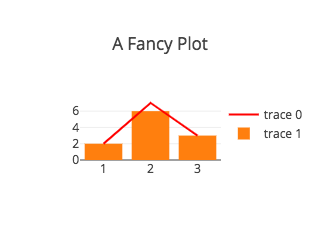

# react-plotly.js


> A [plotly.js](https://github.com/plotly/plotly.js) React component from
> [Plotly](https://plot.ly/). The basis of Plotly's
> [React component suite](https://plot.ly/products/react/).

👉 [DEMO](http://react-plotly.js-demo.getforge.io/)

👉 [Demo source code](https://github.com/plotly/react-plotly.js-demo-app)

---

## Contents

- [Installation](#installation)
- [Quick start](#quick-start)
- [State management](#state-management)
- [Refreshing the Plot](#refreshing-the-plot)
- [API](#api)
  - [Basic props](#basic-props)
  - [Event handler props](#event-handler-props)
- [Customizing the `plotly.js` bundle](#customizing-the-plotlyjs-bundle)
- [Loading from a `<script>` tag](#loading-from-a-script-tag)
- [Development](#development)

## Installation

```bash
$ npm install react-plotly.js plotly.js
```

## Quick start

The easiest way to use this component is to import and pass data to a plot component:

```javascript
import React from 'react';
import Plot from 'react-plotly.js';

class App extends React.Component {
  render() {
    return (
      <Plot
        data={[
          {
            x: [1, 2, 3],
            y: [2, 6, 3],
            type: 'scatter',
            mode: 'lines+markers',
            marker: {color: 'red'},
          },
          {type: 'bar', x: [1, 2, 3], y: [2, 5, 3]},
        ]}
        layout={{width: 320, height: 240, title: 'A Fancy Plot'}}
      />
    );
  }
}
```

You should see a plot like this:

<p align="center">
 
</p>

For a full description of Plotly chart types and attributes see the following resources:

- [Plotly JavaScript API documentation](https://plot.ly/javascript/)
- [Full plotly.js attribute listing](https://plot.ly/javascript/reference/)

## State management

This is a "dumb" component that doesn't merge its internal state with any updates. This means that if a user interacts with the plot, by zooming or panning for example, any subsequent re-renders will lose this information unless it is captured and upstreamed via the `onUpdate` callback prop.

Here is a simple example of how to capture and store state in a parent object:

```javascript
class App extends React.Component {
  constructor(props) {
    super(props);
    this.state = {data: [], layout: {}, frames: [], config: {}};
  }

  render() {
    return (
      <Plot
        data={this.state.data}
        layout={this.state.layout}
        frames={this.state.frames}
        config={this.state.config}
        onInitialized={(figure) => this.setState(figure)}
        onUpdate={(figure) => this.setState(figure)}
      />
    );
  }
}
```

## Refreshing the Plot

This component will refresh the plot via [`Plotly.react`](https://plot.ly/javascript/plotlyjs-function-reference/#plotlyreact) if any of the following are true:

- The `revision` prop is defined and has changed, OR;
- One of `data`, `layout` or `config` has changed identity as checked via a shallow `===`, OR;
- The number of elements in `frames` has changed

Furthermore, when called, [`Plotly.react`](https://plot.ly/javascript/plotlyjs-function-reference/#plotlyreact) will only refresh the data being plotted if the _identity_ of the data arrays (e.g. `x`, `y`, `marker.color` etc) has changed, or if `layout.datarevision` has changed.

In short, this means that simply adding data points to a trace in `data` or changing a value in `layout` will not cause a plot to update unless this is done immutably via something like [immutability-helper](https://github.com/kolodny/immutability-helper) if performance considerations permit it, or unless `revision` and/or [`layout.datarevision`](https://plot.ly/javascript/reference/#layout-datarevision) are used to force a rerender.

## API Reference

### Basic Props

**Warning**: for the time being, this component may _mutate_ its `layout` and `data` props in response to user input, going against React rules. This behaviour will change in the near future once https://github.com/plotly/plotly.js/issues/2389 is completed.

| Prop               | Type                         | Default                                           | Description                                                                                                                                            |
| ------------------ | ---------------------------- | ------------------------------------------------- | ------------------------------------------------------------------------------------------------------------------------------------------------------ |
| `data`             | `Array`                      | `[]`                                              | list of trace objects (see https://plot.ly/javascript/reference/)                                                                                      |
| `layout`           | `Object`                     | `undefined`                                       | layout object (see https://plot.ly/javascript/reference/#layout)                                                                                       |
| `frames`           | `Array`                      | `undefined`                                       | list of frame objects (see https://plot.ly/javascript/reference/)                                                                                      |
| `config`           | `Object`                     | `undefined`                                       | config object (see https://plot.ly/javascript/configuration-options/)                                                                                  |
| `revision`         | `Number`                     | `undefined`                                       | When provided, causes the plot to update when the revision is incremented.                                                                             |
| `onInitialized`    | `Function(figure, graphDiv)` | `undefined`                                       | Callback executed after plot is initialized. See below for parameter information.                                                                      |
| `onUpdate`         | `Function(figure, graphDiv)` | `undefined`                                       | Callback executed when a plot is updated due to new data or layout, or when user interacts with a plot. See below for parameter information.           |
| `onPurge`          | `Function(figure, graphDiv)` | `undefined`                                       | Callback executed when component unmounts, before `Plotly.purge` strips the `graphDiv` of all private attributes. See below for parameter information. |
| `onError`          | `Function(err)`              | `undefined`                                       | Callback executed when a plotly.js API method rejects                                                                                                  |
| `divId`            | `string`                     | `undefined`                                       | id assigned to the `<div>` into which the plot is rendered.                                                                                            |
| `className`        | `string`                     | `undefined`                                       | applied to the `<div>` into which the plot is rendered                                                                                                 |
| `style`            | `Object`                     | `{position: 'relative', display: 'inline-block'}` | used to style the `<div>` into which the plot is rendered                                                                                              |
| `debug`            | `Boolean`                    | `false`                                           | Assign the graph div to `window.gd` for debugging                                                                                                      |
| `useResizeHandler` | `Boolean`                    | `false`                                           | When true, adds a call to `Plotly.Plot.resize()` as a `window.resize` event handler                                                                    |

**Note**: To make a plot responsive, i.e. to fill its containing element and resize when the window is resized, use `style` or `className` to set the dimensions of the element (i.e. using `width: 100%; height: 100%` or some similar values) and set `useResizeHandler` to `true` while setting `layout.autosize` to `true` and leaving `layout.height` and `layout.width` undefined. This can be seen in action in [this CodePen](https://codepen.io/nicolaskruchten/pen/ERgBZX) and will implement the behaviour documented here: https://plot.ly/javascript/responsive-fluid-layout/

#### Callback signature: `Function(figure, graphDiv)`

The `onInitialized`, `onUpdate` and `onPurge` props are all functions which will be called with two arguments: `figure` and `graphDiv`.

- `figure` is a serializable object with three keys corresponding to input props: `data`, `layout` and `frames`.
  - As mentioned above, for the time being, this component may _mutate_ its `layout` and `data` props in response to user input, going against React rules. This behaviour will change in the near future once https://github.com/plotly/plotly.js/issues/2389 is completed.
- `graphDiv` is a reference to the (unserializable) DOM node into which the figure was rendered.

### Event handler props

Event handlers for specific [`plotly.js` events](https://plot.ly/javascript/plotlyjs-events/) may be attached through the following props:

| Prop                      | Type       | Plotly Event                   |
| ------------------------- | ---------- | ------------------------------ |
| `onAfterExport`           | `Function` | `plotly_afterexport`           |
| `onAfterPlot`             | `Function` | `plotly_afterplot`             |
| `onAnimated`              | `Function` | `plotly_animated`              |
| `onAnimatingFrame`        | `Function` | `plotly_animatingframe`        |
| `onAnimationInterrupted`  | `Function` | `plotly_animationinterrupted`  |
| `onAutoSize`              | `Function` | `plotly_autosize`              |
| `onBeforeExport`          | `Function` | `plotly_beforeexport`          |
| `onBeforeHover`           | `Function` | `plotly_beforehover`           |
| `onButtonClicked`         | `Function` | `plotly_buttonclicked`         |
| `onClick`                 | `Function` | `plotly_click`                 |
| `onClickAnnotation`       | `Function` | `plotly_clickannotation`       |
| `onDeselect`              | `Function` | `plotly_deselect`              |
| `onDoubleClick`           | `Function` | `plotly_doubleclick`           |
| `onFramework`             | `Function` | `plotly_framework`             |
| `onHover`                 | `Function` | `plotly_hover`                 |
| `onLegendClick`           | `Function` | `plotly_legendclick`           |
| `onLegendDoubleClick`     | `Function` | `plotly_legenddoubleclick`     |
| `onRelayout`              | `Function` | `plotly_relayout`              |
| `onRelayouting`           | `Function` | `plotly_relayouting`           |
| `onRestyle`               | `Function` | `plotly_restyle`               |
| `onRedraw`                | `Function` | `plotly_redraw`                |
| `onSelected`              | `Function` | `plotly_selected`              |
| `onSelecting`             | `Function` | `plotly_selecting`             |
| `onSliderChange`          | `Function` | `plotly_sliderchange`          |
| `onSliderEnd`             | `Function` | `plotly_sliderend`             |
| `onSliderStart`           | `Function` | `plotly_sliderstart`           |
| `onSunburstClick`         | `Function` | `plotly_sunburstclick`         |
| `onTransitioning`         | `Function` | `plotly_transitioning`         |
| `onTransitionInterrupted` | `Function` | `plotly_transitioninterrupted` |
| `onUnhover`               | `Function` | `plotly_unhover`               |
| `onWebGlContextLost`      | `Function` | `plotly_webglcontextlost`      |

## Customizing the `plotly.js` bundle

By default, the `Plot` component exported by this library loads a precompiled version of all of `plotly.js`, so `plotly.js` must be installed as a peer dependency. This bundle is around 6Mb unminified, and minifies to just over 2Mb.

If you do not wish to use this version of `plotly.js`, e.g. if you want to use a [different precompiled bundle](https://github.com/plotly/plotly.js/blob/master/dist/README.md#partial-bundles) or if your wish to [assemble you own customized bundle](https://github.com/plotly/plotly.js/blob/master/CUSTOM_BUNDLE.md), or if you wish to load `plotly.js` [from a CDN](https://github.com/plotly/plotly.js#use-the-plotlyjs-cdn-hosted-by-fastly), you can skip the installation of as a peer dependency (and ignore the resulting warning) and use the `createPlotComponent` method to get a `Plot` component, instead of importing it:

```javascript
// simplest method: uses precompiled complete bundle from `plotly.js`
import Plot from 'react-plotly.js';

// customizable method: use your own `Plotly` object
import createPlotlyComponent from 'react-plotly.js/factory';
const Plot = createPlotlyComponent(Plotly);
```

## Loading from a `<script>` tag

For quick one-off demos on [CodePen](https://codepen.io/) or [JSFiddle](https://jsfiddle.net/), you may wish to just load the component directly as a script tag. We don't host the bundle directly, so you should never rely on this to work forever or in production, but you can use a third-party service to load the factory version of the component from, for example, [https://unpkg.com/react-plotly.js@latest/dist/create-plotly-component.js](https://unpkg.com/react-plotly.js@latest/dist/create-plotly-component.js).

You can load plotly.js and the component factory with:

```html
<script src="https://cdn.plot.ly/plotly-latest.min.js"></script>
<script src="https://unpkg.com/react-plotly.js@latest/dist/create-plotly-component.js"></script>
```

And instantiate the component with

```javascript
const Plot = createPlotlyComponent(Plotly);

ReactDOM.render(
  React.createElement(Plot, {
    data: [{x: [1, 2, 3], y: [2, 1, 3]}],
  }),
  document.getElementById('root')
);
```

You can see an example of this method in action
[here](https://codepen.io/rsreusser/pen/qPgwwJ?editors=1010).

## Development

To get started:

```bash
$ npm install
```

To transpile from ES2015 + JSX into the ES5 npm-distributed version:

```bash
$ npm run prepublishOnly
```

To run the tests:

```bash
$ npm run test
```

## License

&copy; 2017-2020 Plotly, Inc. MIT License.
