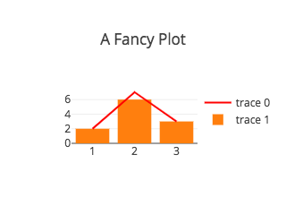

# react-plotly.js


> A [plotly.js](https://github.com/plotly/plotly.js) React component from
> [Plotly](https://plotly.com/).

<div align="center">
  <a href="https://dash.plotly.com/project-maintenance">
    
  </a>
</div>

---

## Contents

- [Installation](#installation)
- [Quick start](#quick-start)
- [State management](#state-management)
- [Refreshing the Plot](#refreshing-the-plot)
- [API](#api-reference)
  - [Basic props](#basic-props)
  - [Event handler props](#event-handler-props)
- [Examples](#examples)
  - [Responsive plot](#responsive-plot)
  - [Event handlers](#event-handlers)
  - [TypeScript](#typescript)
  - [Grabbing the graph div via `ref`](#grabbing-the-graph-div-via-ref)
- [Customizing the `plotly.js` bundle](#customizing-the-plotlyjs-bundle)
- [Loading from a `<script>` tag](#loading-from-a-script-tag)
- [Development](#development)

## Installation

```bash
$ npm install react-plotly.js plotly.js
```

## Quick start

The easiest way to use this component is to import and pass data to a plot component:

```javascript
import Plot from 'react-plotly.js';

function App() {
  return (
    <Plot
      data={[
        {
          x: [1, 2, 3],
          y: [2, 6, 3],
          type: 'scatter',
          mode: 'lines+markers',
          marker: {color: 'red'},
        },
        {type: 'bar', x: [1, 2, 3], y: [2, 5, 3]},
      ]}
      layout={{width: 320, height: 240, title: {text: 'A Fancy Plot'}}}
    />
  );
}
```

You should see a plot like this:

<p align="center">
 
</p>

For a full description of Plotly chart types and attributes see the following resources:

- [Plotly JavaScript API documentation](https://plotly.com/javascript/)
- [Full plotly.js attribute listing](https://plotly.com/javascript/reference/)

## State management

This is a "dumb" component that doesn't merge its internal state with any updates. This means that if a user interacts with the plot, by zooming or panning for example, any subsequent re-renders will lose this information unless it is captured and upstreamed via the `onUpdate` callback prop.

Here is a simple example of how to capture and store state in a parent object:

```javascript
import {useState} from 'react';
import Plot from 'react-plotly.js';

function App() {
  const [figure, setFigure] = useState({data: [], layout: {}, frames: [], config: {}});
  return (
    <Plot
      data={figure.data}
      layout={figure.layout}
      frames={figure.frames}
      config={figure.config}
      onInitialized={setFigure}
      onUpdate={setFigure}
    />
  );
}
```

## Refreshing the Plot

This component will refresh the plot via [`Plotly.react`](https://plotly.com/javascript/plotlyjs-function-reference/#plotlyreact) if any of the following are true:

- The `revision` prop is defined and has changed, OR;
- One of `data`, `layout` or `config` has changed identity as checked via a shallow `===`, OR;
- The number of elements in `frames` has changed

Furthermore, when called, [`Plotly.react`](https://plotly.com/javascript/plotlyjs-function-reference/#plotlyreact) will only refresh the data being plotted if the _identity_ of the data arrays (e.g. `x`, `y`, `marker.color` etc) has changed, or if `layout.datarevision` has changed.

In short, this means that simply adding data points to a trace in `data` or changing a value in `layout` will not cause a plot to update unless this is done immutably via something like [immutability-helper](https://github.com/kolodny/immutability-helper) if performance considerations permit it, or unless `revision` and/or [`layout.datarevision`](https://plotly.com/javascript/reference/#layout-datarevision) are used to force a rerender.

## API Reference

### Basic Props

**Warning**: for the time being, this component may _mutate_ its `layout` and `data` props in response to user input, going against React rules. This behaviour will change in the near future once https://github.com/plotly/plotly.js/issues/2389 is completed.

| Prop               | Type                         | Default                                           | Description                                                                                                                                            |
| ------------------ | ---------------------------- | ------------------------------------------------- | ------------------------------------------------------------------------------------------------------------------------------------------------------ |
| `data`             | `Array`                      | `[]`                                              | list of trace objects (see https://plotly.com/javascript/reference/)                                                                                      |
| `layout`           | `Object`                     | `undefined`                                       | layout object (see https://plotly.com/javascript/reference/#layout)                                                                                       |
| `frames`           | `Array`                      | `undefined`                                       | list of frame objects (see https://plotly.com/javascript/reference/)                                                                                      |
| `config`           | `Object`                     | `undefined`                                       | config object (see https://plotly.com/javascript/configuration-options/)                                                                                  |
| `revision`         | `Number`                     | `undefined`                                       | When provided, causes the plot to update when the revision is incremented.                                                                             |
| `onInitialized`    | `Function(figure, graphDiv)` | `undefined`                                       | Callback executed after plot is initialized. See below for parameter information.                                                                      |
| `onUpdate`         | `Function(figure, graphDiv)` | `undefined`                                       | Callback executed when a plot is updated due to new data or layout, or when user interacts with a plot. See below for parameter information.           |
| `onPurge`          | `Function(figure, graphDiv)` | `undefined`                                       | Callback executed when component unmounts, before `Plotly.purge` strips the `graphDiv` of all private attributes. See below for parameter information. |
| `onError`          | `Function(err)`              | `undefined`                                       | Callback executed when a plotly.js API method rejects                                                                                                  |
| `divId`            | `string`                     | `undefined`                                       | id assigned to the `<div>` into which the plot is rendered.                                                                                            |
| `className`        | `string`                     | `undefined`                                       | applied to the `<div>` into which the plot is rendered                                                                                                 |
| `style`            | `Object`                     | `{position: 'relative', display: 'inline-block'}` | used to style the `<div>` into which the plot is rendered                                                                                              |
| `debug`            | `Boolean`                    | `false`                                           | Assign the graph div to `window.gd` for debugging                                                                                                      |
| `useResizeHandler` | `Boolean`                    | `false`                                           | When true, adds a call to `Plotly.Plot.resize()` as a `window.resize` event handler                                                                    |

**Refs**: a `ref` attached to `<Plot>` resolves to the rendered `<div>` element (the plotly graph div), so you can call low-level plotly.js APIs against it directly (e.g. `Plotly.toImage(ref.current)`).

**TypeScript**: this package ships its own declaration files. Trace and layout shapes are typed as `unknown` since the wrapper does not bind to a specific plotly.js type surface; consumers wanting tighter typing on the `data` / `layout` props can re-declare them locally.

**Note**: To make a plot responsive, i.e. to fill its containing element and resize when the window is resized, use `style` or `className` to set the dimensions of the element (i.e. using `width: 100%; height: 100%` or some similar values) and set `useResizeHandler` to `true` while setting `layout.autosize` to `true` and leaving `layout.height` and `layout.width` undefined. A short example is in the [Responsive plot](#responsive-plot) section below. See also the [responsive layout reference](https://plotly.com/javascript/responsive-fluid-layout/).

#### Callback signature: `Function(figure, graphDiv)`

The `onInitialized`, `onUpdate` and `onPurge` props are all functions which will be called with two arguments: `figure` and `graphDiv`.

- `figure` is a serializable object with three keys corresponding to input props: `data`, `layout` and `frames`.
  - As mentioned above, for the time being, this component may _mutate_ its `layout` and `data` props in response to user input, going against React rules. This behaviour will change in the near future once https://github.com/plotly/plotly.js/issues/2389 is completed.
- `graphDiv` is a reference to the (unserializable) DOM node into which the figure was rendered.

### Event handler props

Event handlers for specific [`plotly.js` events](https://plotly.com/javascript/plotlyjs-events/) may be attached through the following props:

| Prop                      | Type       | Plotly Event                   |
| ------------------------- | ---------- | ------------------------------ |
| `onAfterExport`           | `Function` | `plotly_afterexport`           |
| `onAfterPlot`             | `Function` | `plotly_afterplot`             |
| `onAnimated`              | `Function` | `plotly_animated`              |
| `onAnimatingFrame`        | `Function` | `plotly_animatingframe`        |
| `onAnimationInterrupted`  | `Function` | `plotly_animationinterrupted`  |
| `onAutoSize`              | `Function` | `plotly_autosize`              |
| `onBeforeExport`          | `Function` | `plotly_beforeexport`          |
| `onBeforeHover`           | `Function` | `plotly_beforehover`           |
| `onButtonClicked`         | `Function` | `plotly_buttonclicked`         |
| `onClick`                 | `Function` | `plotly_click`                 |
| `onClickAnnotation`       | `Function` | `plotly_clickannotation`       |
| `onClickAnywhere`         | `Function` | `plotly_clickanywhere`         |
| `onDeselect`              | `Function` | `plotly_deselect`              |
| `onDoubleClick`           | `Function` | `plotly_doubleclick`           |
| `onFramework`             | `Function` | `plotly_framework`             |
| `onHover`                 | `Function` | `plotly_hover`                 |
| `onHoverAnywhere`         | `Function` | `plotly_hoveranywhere`         |
| `onLegendClick`           | `Function` | `plotly_legendclick`           |
| `onLegendDoubleClick`     | `Function` | `plotly_legenddoubleclick`     |
| `onRelayout`              | `Function` | `plotly_relayout`              |
| `onRelayouting`           | `Function` | `plotly_relayouting`           |
| `onRestyle`               | `Function` | `plotly_restyle`               |
| `onRedraw`                | `Function` | `plotly_redraw`                |
| `onSelected`              | `Function` | `plotly_selected`              |
| `onSelecting`             | `Function` | `plotly_selecting`             |
| `onSliderChange`          | `Function` | `plotly_sliderchange`          |
| `onSliderEnd`             | `Function` | `plotly_sliderend`             |
| `onSliderStart`           | `Function` | `plotly_sliderstart`           |
| `onSunburstClick`         | `Function` | `plotly_sunburstclick`         |
| `onTransitioning`         | `Function` | `plotly_transitioning`         |
| `onTransitionInterrupted` | `Function` | `plotly_transitioninterrupted` |
| `onUnhover`               | `Function` | `plotly_unhover`               |
| `onWebGlContextLost`      | `Function` | `plotly_webglcontextlost`      |

## Examples

### Responsive plot

To make the plot fill its container and resize with the window, leave the layout's `width`/`height` unset, enable `autosize`, and turn on `useResizeHandler`. Size the wrapper `<div>` with `style` or `className`:

```javascript
<Plot
  data={[{x: [1, 2, 3], y: [2, 6, 3], type: 'scatter'}]}
  layout={{autosize: true, title: {text: 'Responsive'}}}
  style={{width: '100%', height: '100%'}}
  useResizeHandler
/>
```

### Event handlers

All [plotly.js events](https://plotly.com/javascript/plotlyjs-events/) are surfaced as `on<EventName>` props (see the [Event handler props](#event-handler-props) table). Each handler receives the raw plotly.js event payload:

```javascript
<Plot
  data={[{x: [1, 2, 3], y: [2, 6, 3], type: 'scatter', mode: 'markers'}]}
  layout={{title: {text: 'Click me'}}}
  onClick={(event) => {
    const point = event.points[0];
    console.log(`clicked (${point.x}, ${point.y})`);
  }}
  onRelayout={(event) => {
    if (event['xaxis.range[0]']) {
      console.log('user zoomed to', event['xaxis.range[0]'], event['xaxis.range[1]']);
    }
  }}
/>
```

### TypeScript

The package ships its own declaration files.

```typescript
import Plot, {PlotParams, Figure} from 'react-plotly.js';

const onUpdate = (figure: Figure, gd: HTMLElement) => {
  console.log('figure data length:', figure.data.length, 'gd id:', gd.id);
};

const params: PlotParams = {
  data: [{x: [1, 2, 3], y: [2, 6, 3], type: 'scatter'}],
  layout: {title: {text: 'Typed'}},
  onUpdate,
};

export const App = () => <Plot {...params} />;
```

### Grabbing the graph div via `ref`

A `ref` attached to `<Plot>` resolves to the rendered plotly graph div. Use it to call low-level plotly.js APIs:

```javascript
import {useRef} from 'react';
import Plot from 'react-plotly.js';
import Plotly from 'plotly.js';

function ExportButton() {
  const ref = useRef(null);
  const exportPng = async () => {
    const dataUrl = await Plotly.toImage(ref.current, {format: 'png'});
    console.log(dataUrl);
  };
  return (
    <>
      <Plot ref={ref} data={[{x: [1, 2, 3], y: [2, 6, 3], type: 'scatter'}]} layout={{}} />
      <button onClick={exportPng}>Export PNG</button>
    </>
  );
}
```

## Customizing the `plotly.js` bundle

By default, the `Plot` component exported by this library loads a precompiled version of all of `plotly.js`, so `plotly.js` must be installed as a peer dependency. This bundle is around 6Mb unminified, and minifies to just over 2Mb.

If you do not wish to use this version of `plotly.js`, e.g. if you want to use a [different precompiled bundle](https://github.com/plotly/plotly.js/blob/master/dist/README.md#partial-bundles) or if your wish to [assemble you own customized bundle](https://github.com/plotly/plotly.js/blob/master/CUSTOM_BUNDLE.md), or if you wish to load `plotly.js` [from a CDN](https://github.com/plotly/plotly.js#use-the-plotlyjs-cdn-hosted-by-fastly), you can skip the installation of as a peer dependency (and ignore the resulting warning) and use the `createPlotComponent` method to get a `Plot` component, instead of importing it:

```javascript
// simplest method: uses precompiled complete bundle from `plotly.js`
import Plot from 'react-plotly.js';

// customizable method: use your own `Plotly` object
import createPlotlyComponent from 'react-plotly.js/factory';
const Plot = createPlotlyComponent(Plotly);
```

## Loading from a `<script>` tag

For quick one-off demos in JSFiddle or similar environments, you can load the component directly as a script tag. We don't host the bundle ourselves, so don't rely on this in production, but you can pull it from a CDN such as [unpkg](https://unpkg.com) or [jsdelivr](https://www.jsdelivr.com):

```html
<script src="https://unpkg.com/react@18/umd/react.production.min.js"></script>
<script src="https://unpkg.com/react-dom@18/umd/react-dom.production.min.js"></script>
<script src="https://cdn.plot.ly/plotly-3.6.0.min.js"></script>
<script src="https://unpkg.com/react-plotly.js@latest/dist/create-plotly-component.min.js"></script>
```

React is pinned to 18 here because React 19 stopped shipping UMD builds; consumers wanting React 19 should load it via [importmap](https://developer.mozilla.org/en-US/docs/Web/HTML/Element/script/type/importmap) or use a bundler.

The factory is exposed as the global `createPlotlyComponent`. Build the component and mount it:

```javascript
const Plot = createPlotlyComponent(Plotly);
const root = ReactDOM.createRoot(document.getElementById('root'));
root.render(
  React.createElement(Plot, {
    data: [{x: [1, 2, 3], y: [2, 1, 3]}],
  })
);
```

## Development

To get started:

```bash
$ npm install
```

To build the published artifacts (`dist/index.{mjs,cjs}`, `dist/factory.{mjs,cjs}`, the UMD bundle, and the declaration files) via [tsup](https://tsup.egoist.dev/):

```bash
$ npm run build
```

To run lint + typecheck + jest:

```bash
$ npm run test
```

To watch source files and rebuild on change:

```bash
$ npm run watch
```

Releases are cut from `master` per the steps in [`RELEASE.md`](./RELEASE.md).

## License

&copy; 2017-2026 Plotly, Inc. MIT License.
